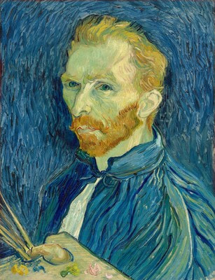
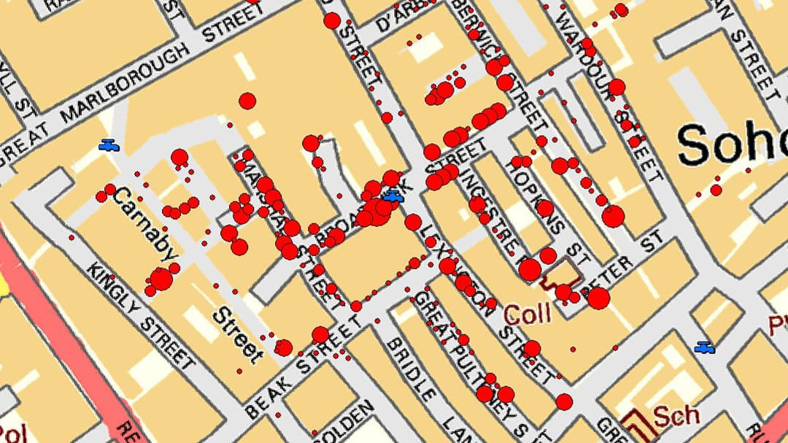
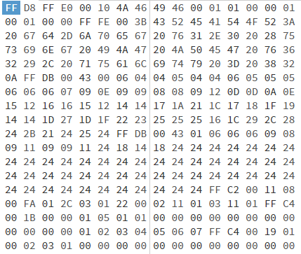
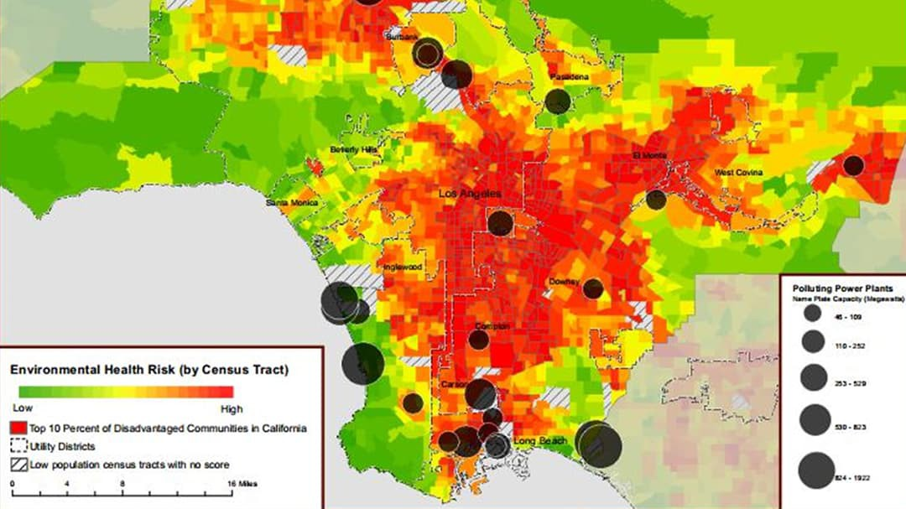

class: hide_logo
```{r setup, echo=FALSE}
knitr::read_chunk('assets/init.R')
```

```{r, echo=FALSE, cache=FALSE, message=FALSE}
<<init>>
```

## Outline `r top_icon("list")`

--

- ### What is a “visualisation”? 
- ### Why do we need visualisations? 

--
- ### Principles of data visualisation and the ‘grammar of graphics’  
- ### About 'mapping': don't reinvent the weel! 

--
- ### Visualisations in epidemiology: beyond scatterplots and pie-charts  

--
- ### Dynamic visualisations: dashboards and interactive graphs


???
Principles and techniques are very general, but we will focus on visualising data to support investigations in epidemiology.

---
## What is a “visualisation”?  `r top_icon("question")`

--
<br/><br/><br/><br/>
#.center[a visual explanation]

--

###.center[*anything that help us understanding something by looking at it*]

<br/>
<br/>
<br/>

.right[.footnotesize[Martin Schweitzer, Data Technologist, [Australian Research Data Commons](https://ardc.edu.au/)]]


???
Key words: 
1. **looking**: obvious, as we are talking about 'visuals"; 
2. **understanding**: less obvious, this is what distinguish the type of visualisations we are talking about (**data** visualisations, with specific reference to epidemiological analysis) for other forms of 'visuals' such as artworks. 

---
class: hide_logo
.pull-left[
.center[

]
]

.pull-right[
.center[

]
]
 
???
The line that separated artworks from the class of visualisations we are focusing in this seminar is thin, and one can easily argue that an artwork can help understanding something just looking at it. 
For example, the painting by the Spanish artist Juan Miro' on the left has a special part in my life and I can definitely say it helped me understanding aspects of mine more than many books and scientific articles... 

But the visualisations we are interested today are those were **the 'explanatory' purpose is at the core**, is the very **reason for their existence**, which is diffcult to say for artworks.

Another difference (again, with a thin separation line) is that data visualisation aim to be less **ambiguous** possible, i.e. they aim at creating the **same understanding** regardless of the viewer, which is not the case of artworks, where the personality and emotional state of the viewer are aintegral part of the understanding.

The map on the right has been created by the city so that anybody sitting, for example, in the civic centre and willing to go to the Waterfront can look at it and (hopefully) has the same understanding of which bus he/she has to catch...

---
class: hide_logo
background-image: url("images/lego.png")
background-position: 50% 45%
background-size: 50%

.footnote[.scriptsize[<cite>`r Citet(bib, "Agrawala2003")`</cite>]]

???
or all the children (or adults?) that is assembling this Lego car, hopefully end up with the same final result...

---
class: hide_logo, center, middle

.pull-left[


.scriptsize[Vincent van Gogh Self-portrait, 1889.<br/>National Gallery of Art. Washington DC]

]

--

.pull-right[
```{r colours_1, paged.print=TRUE, eval=TRUE, echo=FALSE, cache=FALSE, message=FALSE}

# Create hsv grid
d <- expand.grid(h = seq(0, 1, 0.01), s = seq(0, 1, 0.05), v = 1)

ggplot() +
  coord_polar(theta = "x") +
  scale_x_continuous(breaks = NULL) +
  scale_y_continuous(breaks = NULL) +
  scale_fill_identity() +
  geom_rect(data = d, mapping = aes(
    xmin = h, xmax = h + resolution(h),
    ymin = s, ymax = s + resolution(s),
    fill = hsv(h, s, v)
  )) + 
  theme_void()

```
]

???

Note that I did not cite among the differences between 'scientific' and "artistic" visualisations concepts as "visual appeal" or "beauty": those apply to both 
visual artworks and data visualisations in the sense that we are considering today.

A data visualisation that is not visually appealing (with all the ambiguity that this word attracts: I am not a philosopher...), end up conveying less information...
The use of **colours**, **shapes**, ad their combinations follows the same **basic rules** as artistic compositions... 
Both types, at the end of the day, interact with the same type of sensors (the **human eyes**) and processing unit (our brain) and follows the same rules...  

The image on the left is a famous Van Gogh painting, where he uses **contrasting colours** (at the opposite of the **colour weel**)
Colours at the opposite end of the colour weel work together to create high levels of contrast. They make each other bolder and brighter, and our eyes love to see that in different kinds of art.

---
class: hide_logo, center, middle

.pull-left[
```{r colours_2, paged.print=TRUE, eval=TRUE, echo=FALSE, cache=FALSE, message=FALSE}
# Data
a <- data.frame(x = rnorm(20000, 10, 1.9), y = rnorm(20000, 10, 1.2))
b <- data.frame(x = rnorm(20000, 14.5, 1.9), y = rnorm(20000, 14.5, 1.9))
c <- data.frame(x = rnorm(20000, 9.5, 1.9), y = rnorm(20000, 15.5, 1.9))
data <- rbind(a, b, c)

  ggplot(data, aes(x = x, y = y)) +
    geom_hex(bins = 100) + 
    scale_fill_gradient(low = rgb(0.2,0.2,0.2), high = rgb(0.9,0.9,0.9),space = "Lab",na.value = "grey50",
                         aesthetics = "fill"
    )
```
]
--

.pull-right[
```{r colours_3, paged.print=TRUE, eval=TRUE, echo=FALSE, cache=FALSE, message=FALSE}
ggplot(data, aes(x = x, y = y)) +
    geom_hex(bins = 100) + 
    scale_fill_vangogh(palette = "StarryNight", discrete = FALSE, alpha = 1, reverse = FALSE)
```
]

???

This also works for a data visualisation, such as two-dimensional histogram (a **contour plot**, technically).
Using a palette such as the one in the van Gogh painting makes it easier to appreciate the values of the density in different areas. 
And it looks pretty...

---
class: hide_logo, center, middle

.pull-left[

]

.pull-right[
```{r colours_4, paged.print=TRUE, eval=TRUE, echo=FALSE, cache=FALSE, message=FALSE}
ggplot(data, aes(x = x, y = y)) +
    geom_hex(bins = 100) + 
    scale_fill_vangogh(palette = "StarryNight", discrete = FALSE, alpha = 1, reverse = FALSE)
```
]

---
class: hide_logo
background-image: url("images/lang.png"), url("images/lau.png")
background-position: 70% 80%, 20% 10%
background-size: 70%, 70%

.footnote[.scriptsize[<cite>`r Citet(bib, "Lang2009")` `r Citet(bib, "Lau2007")`  </cite>]]

---
class: middle, center

`r top_icon("question")`

# Why visualisations?

### * in epidemiology, applied statistics, data science...*

???
why do we need data visualisations? 
I am focusing now into our field of work: epidemiology and applied statistics...

What data visualisations can give us that numerical methods (staring with the many descriptive statistics we know and use currently) can't?  

Let see some examples... 

---
class: hide_logo, center, middle



???
the utility of data visualisations in epidemiology is definitely not new...
You all recognise John Snow's map that allowed to understand the source of the Cholera epidemic in London (1854) in the Broad street water pump.

"The Broad Street Pump, John Snow memorial, Broadwick Street (formerly Broad Street) in, London. In 1854 an epidemic of cholera affected residents of Soho district. Dr. John Snow surveyed deaths reported in the homes mostly near the pump and used it for their drinking water. His documented evidence suggested that contaminated water from this pump was the source of the epidemic; he caused removal of the handle, and the already declining epidemic due to people leaving the area, ceased entirely."

But let us see some more general examples

---
class: middle, center
`r top_icon("highlighter")`

# 1. Visualisations help to identify .content-box-yellow[patterns], .content-box-yellow[relationships], .content-box-yellow[structures]

???
and, at the end of the day, to give **meaning** hidden among **noise**

---
class: middle
## Example 1

.center[
```{r points_1, paged.print=TRUE, eval=TRUE, echo=FALSE, cache=FALSE, message=FALSE}

x <- c(10,10,20,20,10,30,30,40,40,30,10,10,20,20,10,30,30,40,40,30)
y <- c(10,20,20,10,10,10,20,20,10,10,-10,0,0,-10,-10,-10,0,0,-10,-10)

# Random order
k <- 3
n <- length(x)
rorder <- order(rep(seq_len(ceiling(n/k)), each = k, length.out = n) + runif(n))
x <- x[rorder]
y <- y[rorder]

datamatrix <- cbind(x,y)
colnames(datamatrix) <- NULL
rownames(datamatrix) <- NULL

prmatrix(datamatrix, rowlab = rep("",20), collab = rep("",2))
dataframe <- data.frame(datamatrix)

```
]

---
class: middle, center

```{r points_2, paged.print=TRUE, eval=TRUE, echo=FALSE, cache=FALSE, message=FALSE}

ggplot(dataframe) + aes(x = x, y = y) +
  geom_point(size = 4, col = "red")

```

---
class: middle
## Example 2
 
.pull-left[

]

--
.pull-right[
.center[

]
]

---
class: middle, center
`r top_icon("highlighter")`

# 2. Visualisations let us .content-box-yellow[look beyond the broad features] of the data and see what else is there (i.e. discover what may be not obvious from numerical summaries)


???
i.e. visualisations are useful at the two extremes of data analysis: perceive and appreciate the broad structure of the data 
and look behind those broad features and see what else is there

- Visualisations help us perceive and appreciate some broad features of the data
- Visualisation let us look behind those broad features and see what else is there
*Anscombe1973*

---
class: hide_logo
background-image: url("images/Francis_Anscombe.jpg")
background-position: 20% 50%
background-size: 18%

## Example 3 

.pull-left[
```{r anscombe_code_1, paged.print=FALSE, eval=FALSE, echo=FALSE, cache=FALSE, message=FALSE}
data <- datasets::anscombe[, c(1,5,2,6,3,7,4,8)]
knitr::kable(data, 
  format = "html") %>%
  column_spec(1:8, width = "1.5cm") %>%
  kable_styling(full_width = TRUE) 
```
.footnote[<cite>`r Citet(bib, "Anscombe1973")`</cite>]
]
<br/>
.pull-right[
```{r anscombe_out_1, ref.label="anscombe_code_1", echo=FALSE, cache=FALSE, message=FALSE}
```

]

???
Francis John Anscombe (13 May 1918 – 17 October 2001) was an English statistician.

Anscombe's quartet comprises four data sets that have nearly identical simple descriptive statistics, yet have very different distributions and appear very different when graphed. Each dataset consists of eleven (x,y) points. They were constructed in 1973 by the statistician Francis Anscombe to demonstrate both the importance of graphing data when analyzing it, and the effect of outliers and other influential observations on statistical properties. He described the article as being intended to counter the impression among statisticians that "numerical calculations are exact, but graphs are rough." 

---

```{r anscombe_code_2, paged.print=FALSE, eval=FALSE, echo=FALSE, cache=FALSE, message=FALSE}
round(fBasics::basicStats(data), digits = 4)
```
.code120[
```{r anscombe_out_2, ref.label="anscombe_code_2", echo=FALSE, cache=FALSE, message=FALSE}
```
]

---
background-image: url("images/box_red.png"),url("images/box_red.png"), url("images/box_red.png")
background-position: 80% 39% , 80% 48%, 80% 70%
background-size: 100% 7%, 100% 7%,100% 14% 

.code120[
```{r anscombe_out_2a, ref.label="anscombe_code_2", echo=FALSE, cache=FALSE, message=FALSE}
```
]

---
.pull-left[
```{r anscombe_code_3, paged.print=FALSE, eval=FALSE, echo=TRUE, cache=FALSE, message=FALSE}
"Set 1:"
coefficients(lm(y1 ~ x1, data = data))

"Set 2:"
coefficients(lm(y2 ~ x2, data = data))

"Set 3:"
coefficients(lm(y3 ~ x3, data = data))

"Set 4:"
coefficients(lm(y4 ~ x4, data = data))
```
]
.pull-right[
```{r anscombe_out_3, ref.label="anscombe_code_3", echo=FALSE, cache=FALSE, message=FALSE}
```
]
---

```{r anscombe_code_4, paged.print=FALSE, eval=FALSE, echo=FALSE, cache=FALSE, message=FALSE}
data$id <- 1:nrow(data)
ldata <- reshape(data, direction = "l", idvar = "id", varying = c(1:8), timevar = "Set", sep = "")
ggplot(ldata %>% mutate(Set = as.factor(Set))) + aes(x=x, y=y, col = Set, shape = Set) +
  geom_point(size = 4) + facet_grid(~Set) + theme(text=element_text(size=28))
```

.vcenter-3[
```{r anscombe_out_4, ref.label="anscombe_code_4", echo=FALSE, cache=FALSE, message=FALSE, fig.width = 19}
```
]

---

```{r anscombe_code_5, paged.print=FALSE, eval=FALSE, echo=FALSE, cache=FALSE, message=FALSE}
data$id <- 1:nrow(data)
ldata <- reshape(data, direction = "l", idvar = "id", varying = c(1:8), timevar = "Set", sep = "")
ggplot(ldata %>% mutate(Set = as.factor(Set))) + aes(x=x, y=y, col = Set, shape = Set) +
  geom_point(size = 4) + facet_grid(~Set) + theme(text=element_text(size=28)) +
  {{geom_smooth(method = "lm", se = FALSE)}}
```

.vcenter-3[
```{r anscombe_out_5, ref.label="anscombe_code_5", echo=FALSE, cache=FALSE, message=FALSE, fig.width = 19}
```
]

---
class: middle, center
`r top_icon("highlighter")`

# 3. Visualisations let us convey information in a way that is otherwise difficult/impossible to convey

---
class: hide_logo
background-image: url("images/Roomaney2022d.png")
background-position: 50% 60%
background-size: 60%

## Example 4

.footnote[.scriptsize[<cite>`r Citet(bib, "Roomaney2022d")`</cite>]]

???
Particulate matter 2.5 (micrograms/m2) ambient ozone (ppb)

---
class: hide_logo
## Example 5

.center[



.footnotesize[
*Map of Polluting Power Plants and heat map of environmental risk factors in Los Angeles County*
]
]
.footnote[.scriptsize[https://www.esri.com/en-us/lg/industry/education/data-visualization-provides-capabilities-complex-health-care-issues]]

---
class: hide_logo
background-image: url("images/facebook-network.png")
background-position: 50% 60%
background-size: 47%

## Example 6

.footnote[.scriptsize[https://griffsgraphs.wordpress.com/2012/07/02/a-facebook-network/]]

???
(complex) Social networks

---
class: middle, center
`r top_icon("highlighter")`

# 4. There is more...

---
class: hide_logo
background-image: url("images/Dykes2022.png")
background-position: 50% 50%,
background-size: 100%

.pull-right[
<br/><br/><br/><br/><br/><br/><br/><br/><br/><br/><br/><br/><br/><br/>
</img>
[Supplementary Materials](https://rs.figshare.com/collections/Supplementary_material_from_Visualization_for_epidemiological_modelling_challenges_solutions_reflections_and_recommendations_/6080807)
]
.right[<cite>`r Citet(bib, "Dykes2022")`</cite>]
---
class: hide_logo
## Data visualisation: principles 

<br/>
.center[.large[Graphical visualisations should:]]
- show the data
- induce the viewer to think about the substance rather than about methodology
- avoid distorting what the data have to say
- present many numbers in a small space and make large data sets coherent
- encourage the eye to compare different pieces of data
- reveal the data at several levels of detail
- serve a reasonably clear purpose

.footnote[.scriptsize[<cite>`r Citet(bib, "tufte1985")`</cite>]]

???
A very short summary of the basic principle behind data visualisation

---
class: hide_logo
background-image: url("images/grammar-of-graphics.png")
background-position: 75% 50%
background-size: 30%
## The grammar of graphics

.pull-left[
<br/> 
.large[
in **linguistics**: 

*a grammar is a formal system of rules for generating lawful statements in a language*

in **data visualisation**:

*a grammar is a formal system of rules for generating visual representations of data*

]
]
.footnote[.scriptsize[<cite>`r Citet(bib, "wilkinson2012")`</cite>]]

???
Grammar has a technical meaning in linguistics. In the transformational
theory of Chomsky (1956), **a grammar is a formal system of rules for generating lawful statements in a language**. 

**Grammar makes language expressive**. A language consisting of words
and no grammar (statement = word) expresses only as many ideas as there are
words. **By specifying how words are combined in statements, a grammar expands a language’s scope**.


---
class: middle, hide_logo 
`r top_icon("highlighter")`

<br/> 

# .small[A grammar of graphics is a tool that enables us to .content-box-yellow[concisely describe the components of a graphic]. Such a grammar allows us to move beyond named graphics and .content-box-yellow[gain insight into the deep structure] that underlies statistical graphics.] 

.footnote[.scriptsize[<cite>`r Citet(bib, "Wickham2010")`</cite>]]

---
class: hide_logo 
## Avantages 

<br/><br/><br/>
.center[
# .small[Coherence]
# .small[Consistency]
# .small[Multiple perspectives of the same data]
]

???
Constructing visual representations according to a fixed set of rules (a *grammar*) has as series of advantages

- In many software packages, each graph type is treated separately (scatter plot, pie chart, bar chart).
- This leads to the burden of needing to learn the syntax or interface of each plot type.
- It also obscures the reality that data can typically be visualized in many different ways (and trying out a few is usually beneficial)
- A related challenge is implementing consistent decisions for colors, axis labeling, grid lines, etc.

---
class: hide_logo
background-image: url("images/elements_1.png")
background-position: 50% 50%
background-size: 100%
# Elements of a data visualisation

???
7 elements.
the "grammar of graphics' provides rules to combine the different elements in a "lawful" way in order to produce visual representations of the data.

any visual representation of data must define each of the 7 elements. 

---
background-image: url("images/elements_2.png")
background-position: 50% 50%
background-size: 100%
# Elements of a data visualisation

???
Together, the data, mappings, statistical transformation, and geometric object form a layer.
A plot may have multiple layers, for example, when we overlay a scatterplot with a smoothed line.

---
class: hide_logo
background-image: url("images/grammar-of-graphics.png"), url("images/ggplot2.png")
background-position: 20% 60%, 75% 60%
background-size: 25%, 25%
# R and the grammar of graphics: ggplot 


???
Together, the data, mappings, statistical transformation, and geometric object form a layer.
A plot may have multiple layers, for example, when we overlay a scatterplot with a smoothed line.

---
background-image: url("images/elements_3.png")
background-position: 75% 55%
background-size: 25%
# Building a data visualisation
<br/><br/><br/>


## install.packages(*ggplot2*)

## library(*ggplot2*)

---
class: middle

```{r data_1, include = TRUE, eval = TRUE, message = FALSE, warning = FALSE, comment = "", cache = F}
  load("data/alcohol.RData")   
  alcohol <- subset(alcohol, agecat == "25-34")
  head(alcohol)
```

---

`r chunk_reveal("visual_1")`

```{r visual_1, include = FALSE, eval = FALSE}

ggplot(alcohol) +  
  aes(x = year) + # BREAK
  aes(y = mu) + # BREAK
  geom_point() + # BREAK 
  aes(colour = gender) + # BREAK
  aes(size = 1/mu_se) + # BREAK
  facet_grid(.~gender) + # BREAK
  ylab("Average consumption [g/day]") + # BREAK
  xlab("Year") + # BREAK
  coord_cartesian(ylim = c(0,100)) + # BREAK
  theme_classic() + # BREAK
  theme_gdocs() + # BREAK
  theme_economist()

```

---

`r chunk_reveal("visual_2")`

```{r visual_2, include = FALSE, eval = FALSE}

alcohol <- subset(alcohol, 
                  gender == "Male")
ggplot(alcohol) +  
  aes(x = year) + # BREAK
  aes(y = mu) + # BREAK
  geom_point(colour = "blue") + # BREAK 
  aes(size = 1/mu_se) + # BREAK
  ylab("Average consumption [g/day]") + # BREAK
  xlab("Year") + # BREAK
  coord_polar()


```
---

`r chunk_reveal("visual_3")`

```{r visual_3, include = FALSE, eval = FALSE}

load("data/alcohol.RData") 
alcohol <- subset(alcohol, 
                  gender == "Male" & 
                  year == 2016)

ggplot(alcohol) +  # BREAK
  aes(x = 1) + # BREAK
  aes(y = p) +  # BREAK
  geom_bar(stat = "Identity", 
           position = "stack") +  # BREAK
  aes(fill = agecat) + # BREAK
  coord_polar(theta = "y") + # BREAK
  xlab("") +
  ylab("") +
  theme(axis.text.x=element_blank()) +
  theme(axis.text.y=element_blank()) +
  theme(axis.ticks.x = element_blank()) +
  theme(axis.text.x = element_blank())

```

---
class: hide_logo 
background-image: url("images/separation.png")
background-position: 50% 50%
background-size: 100%

???
separation between data and visualisation, through the different "layers": this is the key for creating dynamic graphs!
(And also to ensure consistency, coordination, clarity...)
Don't mix content with representation!

---
class: hide_logo 
background-image: url("images/cleveland.png")
background-position: 50% 50%
background-size: 80%
## About mapping...


.footnote[.scriptsize[<cite>`r Citet(bib, "cleveland1984")`</cite>]]

---
class: hide_logo 
background-image: url("images/brewer.png")
background-position: 50% 50%
background-size: 70%

.footnote[https://colorbrewer2.org/#type=sequential&scheme=BuGn&n=3]

---

class: middle, hide_logo 

# Visualisations in epidemiology: beyond scatterplots and pie-charts  

???
Just some inspiring example...

---
class: hide_logo
background-image: url("images/gallery.png")
background-position: 50% 50%
background-size: 80%


.footnote[https://r-graph-gallery.com]

---
class: middle, hide_logo 

# Dynamic visualisations: dashboards and interactive graphs

???

new possibilities thansk to cloud computing, cheap servers, development of standards in web programming (HTML5, Javascript, REST APIs..)

just some examples for thinking

---
class: middle, center

.content-box-yellow[https://www.healthdata.org/data-tools-practices/interactive-data-visuals]
<br/><br/><br/>
.content-box-yellow[https://worldmapper.org] 
<br/><br/><br/>
.content-box-yellow[https://guides.lib.umich.edu/c.php?g=282808&p=1884429]

---
class: hide_logo 
background-image: url("images/SACRA.png")
background-position: 50% 50%
background-size: 40%

 https://sacra2.shinyapps.io/alcohol/
 
---
class: hide_logo 
background-image: url("images/surveylab.png")
background-position: 50% 50%
background-size: 80%
 
 https://surveylab.sun.ac.za/
 
---
class: hide_logo
background-image: url("images/reading.png")
background-position: 90% 90%
background-size: 20%
## References  

.scriptsize[
```{r, echo=FALSE, cache=FALSE, message=FALSE, results = 'asis'}

PrintBibliography(bib)
```
]

---
class: su-white
<br/><br/>

.font200[
<p style ="font-size:200%; margin-bottom: -10px; margin-left: -5px;">Thank You!</p>
[ acois@sun.ac.za](mailto:acois@sun.ac.za)
]
<br/><br/>

<div style = "text-align: right; position: fixed; right: 100px;">

</img> <br/><br/>
The rmarkdown code of this presentation is available on GitHub: <br/> 
<a href = "https://github.com/AnnibaleCois/DataVisualisation">https://github.com/AnnibaleCois/DataVisualisation</a> 

</div>

